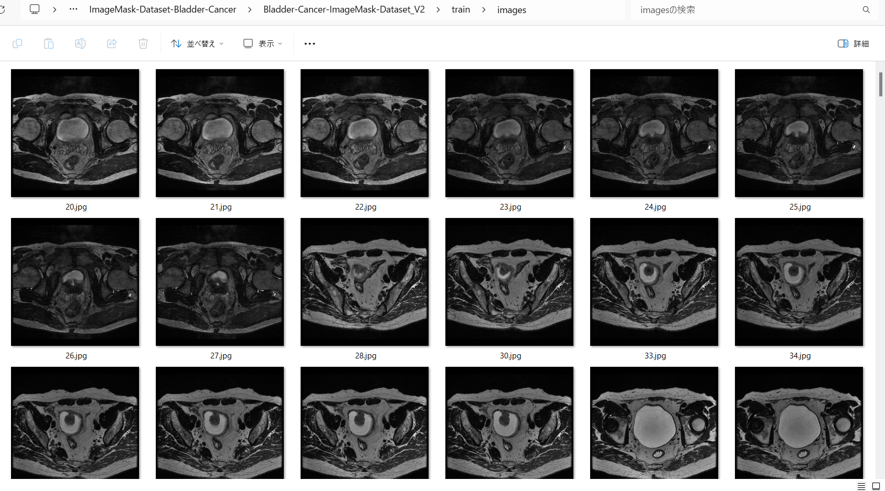

<h2>ImageMask-Dataset-Bladder-Cancer (Updated: 2024/03/15)</h2>
This is a Bladder-Cancer ImageMask Dataset for Image Segmentation.   
 
<li>2024/03/15: Modified to normalize images in bladder_cancer_dataset/tumor_images.</li>
 
<h3>1. Dataset Citatioin</h3>

The image dataset used here has been taken from the following github site. 
<a href="https://github.com/17764592882/bladder_cancer_dataset">bladder_cancer_dataset</a>

<b>About Dataset</b>
<pre>
The source of dataset is the Humble Cup in 2018. There are 768 images of Cancer.
</pre>
<pre>
Thanks to the organizing committee of China College Students Computer Design Competition.Among them, 
there are 768 pictures of lesions, as shown in the folder tumour_label.
The pixel value of 255 represents the lesion spots, the gray area represents the bladder wall, and 
the black area represents the background.The images display in the folder tumour_image are the 
magnetic resonance image.
</pre>

<h3>
2. Download master dataset
</h3>
Please download the original dataset from the following link
<pre>
https://github.com/17764592882/bladder_cancer_dataset
</pre>

bladder_cancer_dataset has the following folder structure. 
<pre>
bladder_cancer_dataset
├─tumor_image
└─tumor_label
</pre>

<h3>
3. Create ImageMask Dataset
</h3>

Please move the "./generator" folder, and run Python script <a href="./generator/ImageMaskDatasetGenerator.py">ImageMaskDatasetGenerator.py</a>..
 
<pre>
>python ImageMaskDatasetGenerator.py
</pre>

This command does the following image processings to generate the test, train and valid sub datasets. 
<pre>
1 Split the files in the original <b>images</b> and <b>masks</b> folders to <b>test</b>, <b>train</b> and <b>valid</b> subsets.
2 Create 512x512 square masks files from the mask files in each subset. 
3 Create 512x512 square images files from the image files in each subset.
</pre>

By using the script above, we have finally created the following dataset. 
<pre>
../Bladder-Cancer-ImageMask-Dataset
├─test
│  ├─images
│  └─masks
├─train
│  ├─images
│  └─masks
└─valid
    ├─images
    └─masks
</pre>

<b>Dataset Statistics</b> 
 
 
<b>train/images samples:</b> 

 
<b>train/masks samples:</b> 

 
 

You can download the latest normalized dataset from the google drive 

<a href="https://drive.google.com/file/d/176ewCOeQA1_lhqjGpykJFhaLdvTRYCn5/view?usp=sharing">
Bladder-Cancer-ImageMask-Dataset_V2.zip</a> (2024/03/15)
 

You can also download the old_dataset from the google drive 
<a href="https://drive.google.com/file/d/1qxBodGJCC_MuEnusmLLj3f7wdRRwjg1S/view?usp=sharing">
Bladder-Cancer-ImageMask-Dataset.zip</a> (2024/03/12)

<h3>
4. Create Augmented ImageMask Dataset
</h3>

Please move the "./generator" folder, and run Python script <a href="./generator/ImageMaskDatasetGenerator.py">ImageMaskDatasetGenerator.py</a>..
 
<pre>
>python ImageMaskDatasetGenerator.py True
</pre>

This command does the following image processings to generate the test, train and valid sub datasets. 
<pre>
1 Split the files in the original <b>images</b> and <b>masks</b> folders to <b>test</b>, <b>train</b> and <b>valid</b> subsets.
2 Create 512x512 square masks files from the mask files in each subset. 
3 Create 512x512 square images files from the image files in each subset.
</pre>

By using the script above, we have finally created the following dataset. 
<pre>
../Augmented-Bladder-Cancer-ImageMask-Dataset
├─test
│  ├─images
│  └─masks
├─train
│  ├─images
│  └─masks
└─valid
    ├─images
    └─masks
</pre>

<b>Dataset Statistics</b> 
 
 
 
You can also download the latest normalized dataset from the google drive 
<a href="https://drive.google.com/file/d/1BEVmUjRoUl42OyNinA7H9i7opvzW-bWC/view?usp=sharing">
Augmented-Bladder-Cancer-ImageMask-Dataset_V2.zip</a> (2024/03/15)

 
You can also download the old dataset from the google drive 
<a href="https://drive.google.com/file/d/1giA8mQWCfCFpuivDrsrFY7bHT7KutM_q/view?usp=sharing">
Augmented-Bladder-Cancer-ImageMask-Dataset.zip</a> (2024/03/14)

